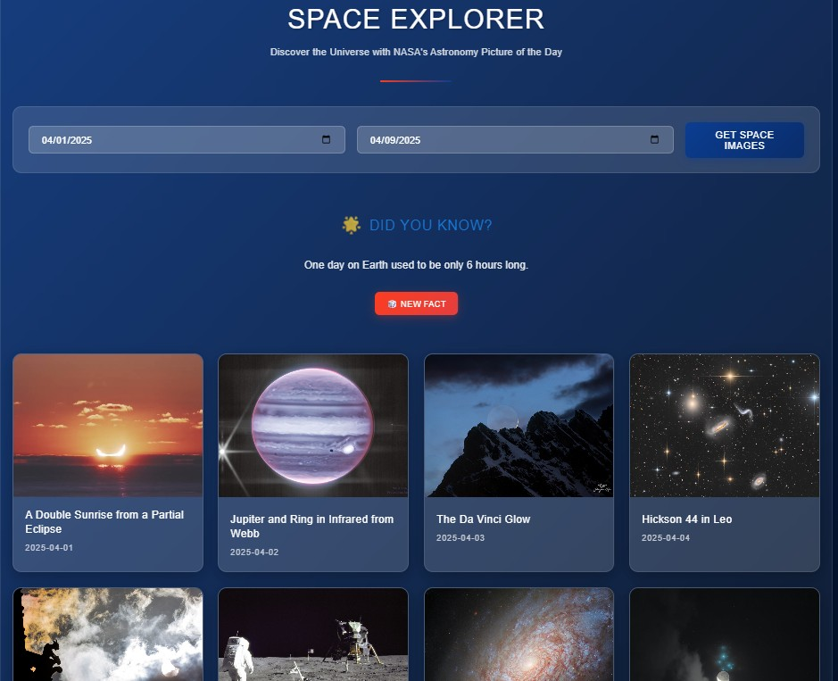

# 🚀 NASA Space Explorer

Explore the cosmos with the **NASA Space Explorer**, a sleek and responsive web app that brings you real-time images and videos from NASA's Astronomy Picture of the Day (APOD) API. Built as part of the Global Career Acceleration program, this project blends creativity, branding precision, and API mastery into a visually stunning educational experience.

🔗 **Live Site**: [https://vader941.github.io/07-nasa-space-explorer/](https://vader941.github.io/07-nasa-space-explorer/)



---

## 🌌 Features

- 📅 **Date Range Selector** — Fetch APOD entries by selecting any date range from 1995 to today.
- 🖼️ **Dynamic Media Gallery** — Display images and YouTube videos from NASA’s API.
- 📖 **Space Facts System** — Get randomized “Did You Know?” space facts with a refresh button.
- 🔍 **Interactive Modal Viewer** — Click on any gallery item for a larger image/video with full details.
- ✨ **Smooth Hover Zoom Effects** — Adds modern UI interactivity.
- ⏳ **Loading States** — Shows animated feedback while fetching images.
- 🎨 **Official NASA Branding** — Colors, fonts, logos, and design patterns follow NASA’s official style guides.
- 📱 **Fully Responsive Design** — Works great on mobile, tablet, and desktop.

---

## 🧠 How It Works

1. **Date Input** — Select a start and end date using the input fields.
2. **API Fetch** — Click “Get Space Images” to fetch media items from NASA’s APOD API.
3. **Gallery Generation** — Images and video thumbnails are displayed in a responsive grid.
4. **Fact Display** — A random space fact appears on load, with the option to refresh it.
5. **Modal View** — Clicking any item opens a detailed view with a full explanation.

---

## 🧰 Tech Stack

- **HTML5** – Semantic structure
- **CSS3** – Custom theming, responsiveness, animations
- **JavaScript (ES6+)** – Async fetch, dynamic rendering, modular logic
- **NASA APOD API** – Real-time data from NASA
- **GitHub Codespaces + Pages** – Dev environment & deployment

---

## 🗂️ Project Structure

```bash
├── index.html
├── style.css
├── /js
│   ├── script.js          # Main app logic
│   ├── dateRange.js       # Validates date ranges
│   └── spaceFacts.js      # Space facts array + logic
├── /img
│   ├── nasa-logo.svg
│   ├── nasa-worm-logo.png
│   └── readme-demo.jpg    # Screenshot
└── README.md              # You're reading it!
```

---

## 💬 Reflections

This project helped reinforce my understanding of asynchronous JavaScript, real-world API integration, DOM manipulation, and responsive design best practices. I also explored media handling logic for mixed content (images vs. videos), improved UX through loading states and modal interactions, and deepened my appreciation for thoughtful visual design.

---

## 📌 Future Enhancements

- Add image/video filtering
- Save user favorites
- Integrate additional NASA APIs (e.g., Mars Rover, EPIC)
- Service workers for offline access
- Carousel/timeline view modes
- Social sharing functionality

---

> _“Somewhere, something incredible is waiting to be known.” – Carl Sagan_
